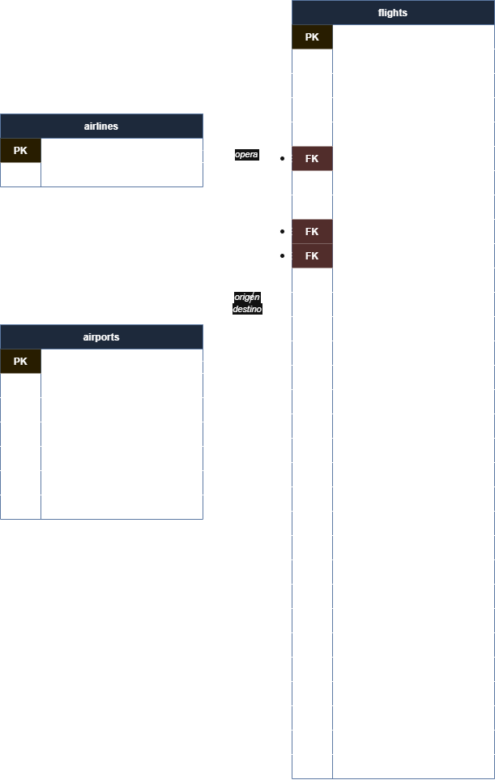

# Flights Data Engineering — End-to-End Pipeline

## Descripción del proyecto

Este repositorio implementa un pipeline de datos **end-to-end** sobre el dataset de vuelos domésticos de Estados Unidos en 2015 (~5.8 millones de vuelos). El pipeline sigue la **arquitectura Medallion** (Bronze → Silver → Gold) sobre Amazon S3, AWS Glue y Athena, complementado con un modelo relacional en PostgreSQL y un análisis estadístico con regresión y pronóstico de series de tiempo.

---

## 🎯 Objetivo

Construir, de principio a fin, un pipeline de datos de producción que cubra:

- **ETL scripts** que implementan la arquitectura Medallion Bronze → Silver → Gold sobre S3 y Athena con AWS Glue Data Catalog
- **Modelo relacional** en PostgreSQL provisionado con CloudFormation y cargado con SQLAlchemy
- **Análisis exploratorio** en Jupyter con visualizaciones sobre las agregaciones Silver y Gold
- **Regresión estadística** con `statsmodels` para identificar los factores que explican el retraso de llegada
- **Pronóstico de series de tiempo** con `StatsForecast` (AutoETS, AutoARIMA, AutoTheta) sobre la demanda mensual de vuelos

---

## 📚 Dataset

**Fuente:** vuelos domésticos de EE.UU. — 2015

| Archivo | Filas | Descripción |
|---------|-------|-------------|
| `flights.csv` | ~5.8M | Un registro por vuelo: fechas, aerolínea, origen, destino, demoras, cancelaciones |
| `airlines.csv` | 14 | Catálogo de aerolíneas: código IATA y nombre completo |
| `airports.csv` | 322 | Catálogo de aeropuertos: código IATA, nombre, ciudad, estado, lat/lon |

> Los archivos CSV no están en el repositorio (`.gitignore`). Se descargan desde S3 del curso con:
> ```bash
> aws s3 cp s3://itam-analytics-dante/flights-hwk/flights.zip . --no-sign-request
> unzip flights.zip -d data/
> ```

---

## 🏗️ Arquitectura

```
datos/
  flights.csv
  airlines.csv         ──► etl/bronze.py ──► S3 Bronze / Glue
  airports.csv                │
                              ▼
                         etl/silver.py ──► S3 Silver / Glue
                              │             (Parquet + Snappy)
                              ▼
                         etl/gold.py  ──► Athena CTAS
                                          flights_gold.vuelos_analitica

                    etl/postgres_etl.py ──► RDS PostgreSQL
                    (airlines, airports, flights — 500k vuelos)
```

---

## 🗂️ Estructura del repositorio

```text
flights-data-engineering-a/
├── .gitignore
├── README.md
├── docs/
│   ├── erd-flights.drawio      # Diagrama entidad-relación (editable)
│   └── erd-flights.png         # Imagen del ERD
├── etl/
│   ├── bronze.py               # Ingesta CSV → S3 Bronze + Glue
│   ├── silver.py               # Transformaciones → S3 Silver + Glue
│   ├── gold.py                 # CTAS en Athena → Gold analítica
│   └── postgres_etl.py         # Schema + carga de datos en PostgreSQL
├── img/
│   └── ...                     # Screenshots de ejecución
└── infra/
    └── rds-flights.yaml        # CloudFormation: RDS PostgreSQL + Read Replica
```

---

## 🗺️ Diagrama Entidad-Relación (ERD)



Tres entidades principales:
- **airlines** — catálogo de aerolíneas (`iata_code` PK)
- **airports** — catálogo de aeropuertos (`iata_code` PK)
- **flights** — registro de vuelos con dos FK a `airports` (origen y destino) y una FK a `airlines`

---

## 🚀 Cómo ejecutar el ETL

### Prerrequisitos

- Python 3.12+
- AWS credentials configuradas en SageMaker Studio
- Bucket S3 propio en tu cuenta de AWS

### 1. Instalar dependencias

```bash
pip install awswrangler pandas boto3
```

### 2. Correr el pipeline Medallion en orden

```bash
# Bronze — sube los CSVs a S3 y registra en Glue
python etl/bronze.py --bucket <tu-bucket> --data-dir data/

# Silver — transforma a Parquet + Snappy y construye agregaciones
python etl/silver.py --bucket <tu-bucket>

# Gold — CTAS en Athena que desnormaliza flights con aerolíneas y aeropuertos
python etl/gold.py --bucket <tu-bucket>
```

### 3. Provisionar PostgreSQL con CloudFormation

Despliega `infra/rds-flights.yaml` desde la consola de AWS CloudFormation con los parámetros:

| Parámetro | Valor |
|-----------|-------|
| `DBName` | `flights` |
| `DBUsername` | `itam` |
| `CreateReadReplica` | `true` |

Una vez el stack esté en `CREATE_COMPLETE`, obtén los endpoints del tab **Outputs**.

### 4. Cargar datos en PostgreSQL

```bash
python etl/postgres_etl.py \
  --endpoint <RdsEndpoint> \
  --data-dir data/
```

> Las credenciales se recuperan automáticamente desde AWS Secrets Manager (`itam/rds/flights/credentials`).

---

## 📊 Tablas Silver generadas

| Tabla | Descripción | Partición |
|-------|-------------|-----------|
| `flights_daily` | Vuelos por día: total, retrasados, cancelados, retraso promedio | `MONTH` |
| `flights_monthly` | Vuelos por mes y aerolínea: totales, puntualidad | — |
| `flights_by_airport` | Vuelos por aeropuerto origen: retrasos, cancelaciones, % clima | — |

---

## 📸 Evidencia de ejecución

| Paso | Screenshot |
|------|------------|
| Glue — `flights_bronze` con 3 tablas | `img/glue_data_bronze.png` |
| Glue — `flights_silver` con 3 tablas | *(pendiente)* |
| Athena — `SELECT * FROM flights_gold.vuelos_analitica LIMIT 5` | *(pendiente)* |
| CloudFormation — stack `CREATE_COMPLETE` | *(pendiente)* |
| DBeaver — `SELECT COUNT(*)` por tabla | *(pendiente)* |

---

## 📌 Scripts del pipeline

| Script | Input | Output |
|--------|-------|--------|
| `etl/bronze.py` | CSVs locales en `data/` | S3 Bronze + Glue `flights_bronze` |
| `etl/silver.py` | S3 Bronze | S3 Silver + Glue `flights_silver` |
| `etl/gold.py` | Glue Bronze | Athena `flights_gold.vuelos_analitica` |
| `etl/postgres_etl.py` | CSVs locales en `data/` | RDS PostgreSQL `flights` |

---

📤 **Contacto:**
- Paulina Garza — paugarza2208@gmail.com
- Andrea Monserrat Arredondo Rodríguez — andrea.monserrat.ar@gmail.com
